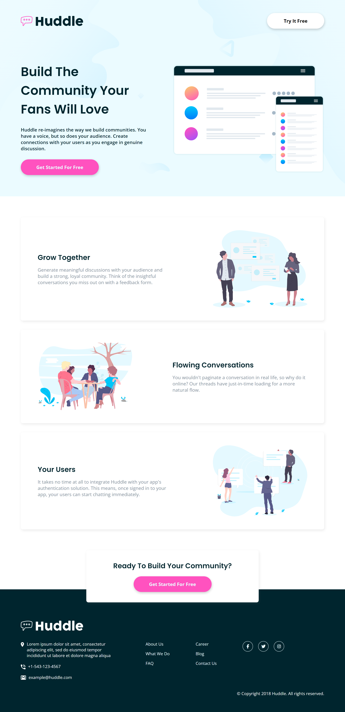
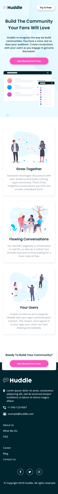

# Frontend Mentor - Huddle landing page with alternating feature blocks solution

This is a solution to the [Huddle landing page with alternating feature blocks challenge on Frontend Mentor](https://www.frontendmentor.io/challenges/huddle-landing-page-with-alternating-feature-blocks-5ca5f5981e82137ec91a5100). Frontend Mentor challenges help you improve your coding skills by building realistic projects. 

## Overview

### Links

- Solution URL: [Github](https://github.com/Affan840/Huddle-Landing-Page-With-Alternating-Feature-Blocks)
- Live Site URL: [Live Preview](https://affan840.github.io/Huddle-Landing-Page-With-Alternating-Feature-Blocks/)

### Screenshot

## Desktop

## Mobile

### Built with

- Semantic HTML5 markup
- CSS custom properties
- Flexbox
- JavaScript

## Author

- Instagram - [@muhammad__affan07](https://www.instagram.com/muhammad__affan07/)